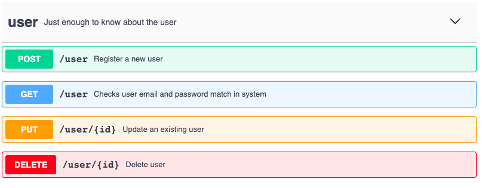

# COMP2001_API

This repository contains the code for the COMP2001 Authenticator API coursework.  It is created in Visual Studio 2019 using the C# language and the Web API template.  

The API provides the implementation for the [attached yaml file](COMP2001_API.yaml) contract.  This means there is just one endpoint, User.  The endpoint responds to the GET, PUT, POST and DELETE HTTP verbs only and uses the JSON User object as outlined in the file.

## Data Layer
The tables, constraints, stored procedures, view and trigger were created as per the specification.  SQL code is provided in [this file](auth.sql).  

Passwords are not stored in plain text in the database but are hashed.  The Register stored procedure ensures this requirement is enforced.  

